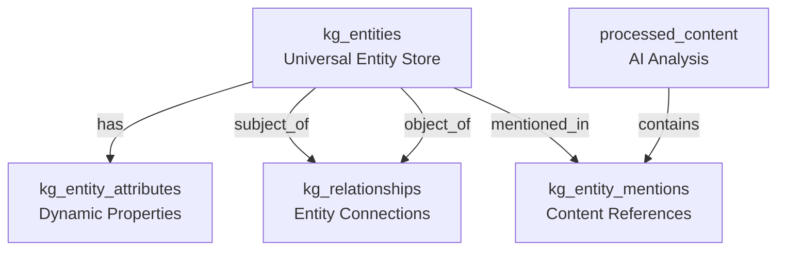
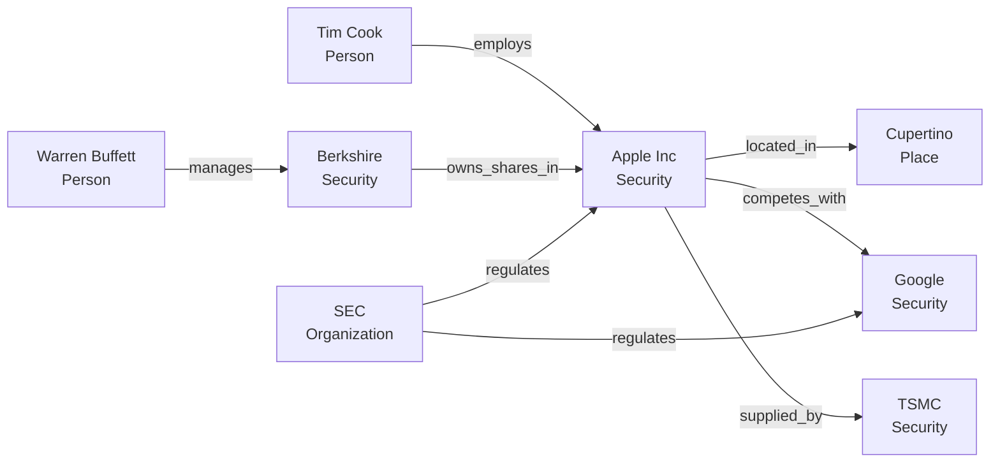

# Knowledge Graph Entity System Design

## Overview

The enhanced entity system transforms the Silver Fin Monitor from a simple stock tracker into a comprehensive knowledge graph that can map relationships between securities, people, organizations, places, and events.

## Entity Types Supported

### 1. **Securities** (Original entities)
- Stocks (AAPL, GOOGL, etc.)
- ETFs
- Mutual Funds
- REITs
- Bonds (future)

### 2. **People**
- Executives (CEOs, CFOs, CTOs)
- Board Members
- Analysts
- Investors
- Regulators
- Politicians (when market-relevant)

### 3. **Organizations**
- Public Companies
- Private Companies
- Investment Firms
- Regulatory Bodies
- Government Agencies
- Research Institutions

### 4. **Places**
- Countries
- States/Provinces
- Cities
- Regions
- Headquarters Locations
- Manufacturing Sites

### 5. **Events** (Future Extension)
- Earnings Calls
- Product Launches
- Mergers & Acquisitions
- Regulatory Actions
- Economic Events

### 6. **Topics** (Future Extension)
- Industries
- Technologies
- Market Themes
- Economic Indicators

## Knowledge Graph Architecture

### Core Tables



### Relationship Examples



## Key Features

### 1. **Flexible Entity Model**
```sql
kg_entities
├── entity_type (security, person, organization, place)
├── entity_subtype (stock, ceo, public_company, city)
├── common fields (name, aliases, description)
├── type-specific fields (symbol, title, coordinates)
└── metadata (importance_score, external_ids)
```

### 2. **Rich Relationships**
```sql
kg_relationships
├── subject_id → kg_entities
├── predicate (employs, owns, located_in, competes_with)
├── object_id → kg_entities
├── temporal validity (valid_from, valid_to)
├── strength (0-100)
└── confidence (0-100)
```

### 3. **Dynamic Attributes**
```sql
kg_entity_attributes
├── entity_id → kg_entities
├── attribute_type (financial_metric, contact_info)
├── attribute_name (revenue_2023, twitter_handle)
├── attribute_value
├── temporal validity
└── source tracking
```

### 4. **Content Integration**
```sql
kg_entity_mentions
├── entity_id → kg_entities
├── content_id → processed_content
├── mention details (positions, context)
├── sentiment_score
├── relevance_score
└── extracted facts
```

## Use Cases

### 1. **Executive Tracking**
Track when executives change companies, their statements, and market impact:
```sql
-- Find all companies where Elon Musk has a role
SELECT 
    company.name,
    r.predicate,
    r.properties->>'position' as role
FROM kg_relationships r
JOIN kg_entities person ON r.object_id = person.id
JOIN kg_entities company ON r.subject_id = company.id
WHERE person.name = 'Elon Musk'
AND r.is_current = true;
```

### 2. **Supply Chain Mapping**
Understand dependencies between companies:
```sql
-- Find Apple's suppliers
SELECT 
    supplier.name,
    supplier.symbol,
    r.strength as relationship_strength
FROM kg_relationships r
JOIN kg_entities apple ON r.object_id = apple.id
JOIN kg_entities supplier ON r.subject_id = supplier.id
WHERE apple.symbol = 'AAPL'
AND r.predicate = 'supplies'
AND r.is_current = true
ORDER BY r.strength DESC;
```

### 3. **Geographic Analysis**
Analyze companies by location:
```sql
-- Find all tech companies in California
SELECT 
    company.name,
    company.symbol,
    city.name as city,
    attrs.attribute_value as market_cap
FROM kg_entities company
JOIN kg_relationships r1 ON r1.subject_id = company.id
JOIN kg_entities city ON r1.object_id = city.id
JOIN kg_relationships r2 ON r2.subject_id = city.id
JOIN kg_entities state ON r2.object_id = state.id
LEFT JOIN kg_entity_attributes attrs ON attrs.entity_id = company.id
    AND attrs.attribute_name = 'market_cap'
WHERE state.name = 'California'
AND company.entity_type = 'security'
AND r1.predicate = 'headquartered_in'
AND r2.predicate = 'located_in';
```

### 4. **Sentiment Analysis by Entity**
Track how different entities are mentioned:
```sql
-- Get sentiment for all entities mentioned with Apple
SELECT 
    related.name,
    related.entity_type,
    AVG(m2.sentiment_score) as avg_sentiment,
    COUNT(*) as mention_count
FROM kg_entity_mentions m1
JOIN kg_entities apple ON m1.entity_id = apple.id
JOIN kg_entity_mentions m2 ON m2.content_id = m1.content_id
JOIN kg_entities related ON m2.entity_id = related.id
WHERE apple.symbol = 'AAPL'
AND m1.created_at > CURRENT_DATE - 30
AND related.id != apple.id
GROUP BY related.id, related.name, related.entity_type
ORDER BY mention_count DESC;
```

### 5. **Network Analysis**
Find hidden connections:
```sql
-- Use the get_entity_graph function
SELECT get_entity_graph(
    (SELECT id FROM kg_entities WHERE symbol = 'AAPL'),
    2 -- depth
);
```

## API Integration

### Entity Search Endpoint
```typescript
// GET /api/v2/entities/search?q=apple
{
  "results": [
    {
      "id": "123",
      "entity_type": "security",
      "name": "Apple Inc.",
      "symbol": "AAPL",
      "relevance": 1.0
    },
    {
      "id": "456", 
      "entity_type": "person",
      "name": "Tim Apple (Tim Cook)",
      "title": "CEO",
      "relevance": 0.8
    }
  ]
}
```

### Entity Graph Endpoint
```typescript
// GET /api/v2/entities/:id/graph?depth=2
{
  "nodes": [
    {"id": "123", "name": "Apple Inc.", "type": "security"},
    {"id": "456", "name": "Tim Cook", "type": "person"},
    {"id": "789", "name": "Cupertino", "type": "place"}
  ],
  "edges": [
    {"source": "123", "target": "456", "predicate": "employs"},
    {"source": "123", "target": "789", "predicate": "headquartered_in"}
  ]
}
```

## Benefits

1. **Comprehensive Intelligence**: Track not just stocks but the entire ecosystem
2. **Relationship Insights**: Understand hidden connections and dependencies
3. **Enhanced NLP**: Better entity extraction and disambiguation
4. **Predictive Power**: Use relationship changes as leading indicators
5. **Rich Context**: Every entity has full context and history

## Migration Strategy

1. **Phase 1**: Create knowledge graph tables alongside existing entities
2. **Phase 2**: Migrate existing entities to kg_entities
3. **Phase 3**: Extract people and organizations from existing content
4. **Phase 4**: Build relationship graph from news and filings
5. **Phase 5**: Deprecate old entities table

## Future Enhancements

1. **Graph Analytics**
   - PageRank for entity importance
   - Community detection for sector analysis
   - Path analysis for influence tracking

2. **Machine Learning**
   - Relationship prediction
   - Entity disambiguation
   - Anomaly detection in relationship changes

3. **Visualization**
   - Interactive network graphs
   - Temporal relationship changes
   - Geographic heat maps

4. **External Integration**
   - Wikidata for entity enrichment
   - LinkedIn for executive tracking
   - Crunchbase for startup data

This knowledge graph architecture transforms Silver Fin Monitor into a true market intelligence platform that understands not just what stocks are doing, but why they're moving based on the complex web of relationships in the market.